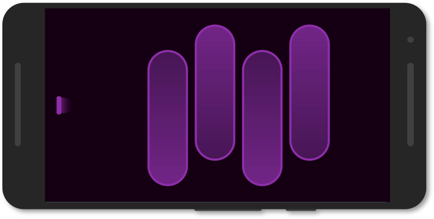
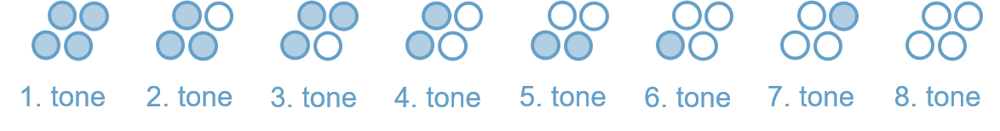

 
 
 
 
 

<h6 align=center>
    Virtual Ocarina
</h6>
 
 
 
 
 
 

# Virtual Ocarina

> Virtual ocarina flute for mobile platforms.

The "Virtual Ocarina" is a virtual instrument for mobile platforms that support multi-touch and microphone input. The project is developed with Unity. It was originally created for use in lectures at the university to teach the principles of simple audio input and bitmasks.

     
     
    
     
     

## Playing the Virtual Ocarina

Blow into the microphone to produce sounds. Press the keys to create different tones. Different key combinations produce different tones. The combinations are based on a real four-hole ocarina. Currently, we are only considering the key combination of the major scale. Filled circles mean pressed keys (closed holes on a real ocarina), empty circles mean non-pressed keys (open holes on a real ocarina):

     
     
    
     
     

## License & Third Party Content

This project is licensed under a MIT license. See the [LICENSE](/LICENSE) file for details. Some assets in this project may be shared under a different license. Check out the README files in the directories and the [Third Party Content](/ThirdPartyContent.md) file for details.

Many assets of this project were created by other people. Check out the [Third Party Content](/ThirdPartyContent.md) file for details.

## Support & Contribute

This project was created by [Daniel Dyrda](https://dyrda.io). If you want to support me and my projects, you can follow me on [github (dyrdadev)](https://github.com/dyrdadev) and [twitter (@daniel_dyrda)](https://twitter.com/daniel_dyrda). Just come by and say hello, I would love to hear how you use the project.

If you want to contribute to this project, you are welcome to do so. Just write me and we will find a way to collaborate.
